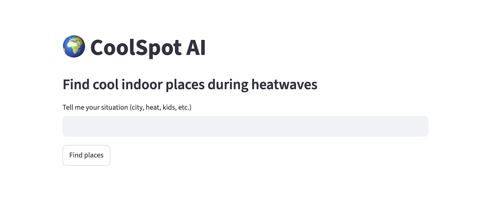

# 📍 CoolSpot AI

> A lightweight AI assistant that suggests indoor places to stay cool during hot weather — powered by LLM reasoning (Gemini) + Streamlit.

---

## 🚀 Demo

Ask things like:

- “It’s 35°C in Utrecht with my 6 year old kid”
- “I’m in Amsterdam and need indoor places to cool down”
- “Suggest kid-friendly indoor places in Rotterdam during heatwave”

The app responds with:

- City detection
- Context-aware reasoning (heat, kids, urgency)
- Real indoor place suggestions

---

## 🧠 Features

- 🌍 Dynamic city understanding from user input
- 👶 Kid-friendly place suggestions
- 🔥 Heat-aware recommendations
- 🤖 LLM-powered reasoning (Gemini)
- 💬 Simple Streamlit chat interface
- ⚡ No external APIs (fully stable demo mode)

---

## 🏗️ Architecture

```text
User Input
   ↓
Streamlit UI
   ↓
Gemini LLM (Prompt-based reasoning)
   ↓
Response (Indoor place recommendations)
```

---

## 📦 Tech Stack

- Python 3.10+
- Streamlit
- LangChain
- Google Gemini (via `langchain-google-genai`)
- python-dotenv

---

## 📁 Project Structure

```text
coolspot-ai/
│
├── app.py                  # Streamlit UI
├── .env                    # API keys (not committed)
├── .env.example           # Sample environment file
├── requirements.txt       # Dependencies
│
├── agent/
│   └── coolspot_agent.py  # Core LLM logic
```

---

## ⚙️ Setup Instructions

### 1. Clone the repo

```bash
git clone https://github.com/your-username/coolspot-ai.git
cd coolspot-ai
```

---

### 2. Create virtual environment

```bash
python -m venv .venv
source .venv/bin/activate   # Mac/Linux
# .venv\Scripts\activate    # Windows
```

---

### 3. Install dependencies

```bash
pip install -r requirements.txt
```

---

### 4. Add environment variables

Create a `.env` file:

```env
GOOGLE_API_KEY=your_api_key_here
MODEL=gemini-2.5-flash
```

---

### 5. Run the app

```bash
streamlit run app.py
```

---

## 🧪 Example Inputs

Try these in the UI:

- “It’s 38°C in Amsterdam, need indoor places”
- “I’m in Utrecht with my 6-year-old kid, it’s very hot”
- “Suggest cool indoor places in Rotterdam”

---

## 💡 Design Philosophy

This project intentionally avoids external APIs and complex tool chains to ensure:

- Stability over complexity
- Fast response time
- Reliable demo experience
- Easy GitHub sharing

It demonstrates how far you can go with **good prompting + LLM reasoning alone**.

---

## 🔮 Future Improvements

- Real-time weather API integration
- Google Places / OpenStreetMap support
- Heat severity scoring system
- Map-based UI
- Multi-agent tool system

---

## 📸 Screenshot



---

## 👨‍💻 Author

Built as a learning project to explore:

- LLM-based reasoning systems
- Lightweight AI agents
- Streamlit app development

---

